# Daniel Cerverizzo

**Design Engineer** — I turn product decisions into interfaces that convert.

[](https://cerverizzo.dev)
[](https://dev.to/dcerverizzo)
[](https://linkedin.com/in/danielcerverizzo)

---

## About

10+ years building production-grade interfaces at the intersection of engineering precision and product thinking. Currently at [@cobrefacil](https://github.com/cobrefacil), shipping billing and payment infrastructure used by thousands of Brazilian businesses.

I care about the details most engineers skip: the empty states, the error messages that actually tell you what to fix, the CTA that stays visible when you scroll. Those decisions move metrics.

Two results I'm proud of:
- Redesigned a mobile webinar experience → **45% reduction in abandonment**
- Rebuilt a payment checkout UI → **+22% conversion rate in production**

---

## Stack

**Core**


**Design & UI**


**Infrastructure**


**AI Tooling**


---

## Currently Building

- **[cerverizzo.dev/work](https://cerverizzo.dev/work)** — Case studies documenting the product decisions behind real metric improvements
- Design systems and component libraries for production SaaS products
- AI-augmented development workflows using Claude SDK + TypeScript

---

## Writing

I write about UI decisions, frontend architecture, and product engineering on dev.to.

- [Microfrontends: Solution or Distributed Complexity?](https://dev.to/dcerverizzo)
- [Comprehension Debt: The Hidden Cost of Coding Without Understanding](https://dev.to/dcerverizzo)

All articles: [dev.to/dcerverizzo](https://dev.to/dcerverizzo)

---

## GitHub Metrics



## Achievements


---

## WakaTime — 7,198 hrs logged since 2018

<!--START_SECTION:waka-->

```txt
From: 08 October 2018 - To: 21 July 2026

Total Time: 7,213 hrs 52 mins

PHP                        2,149 hrs 51 mins>>>>>>>------------------   29.80 %
Twig                       1,393 hrs 11 mins>>>>>--------------------   19.31 %
JavaScript                 975 hrs 33 mins >>>----------------------   13.52 %
ERB                        970 hrs 24 mins >>>----------------------   13.45 %
TypeScript                 603 hrs 45 mins >>-----------------------   08.37 %
```

<!--END_SECTION:waka-->

---

Open to remote roles · danielcerverizzo@gmail.com
